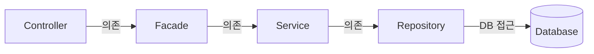
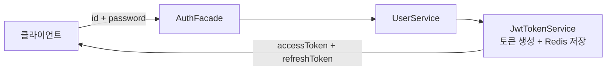
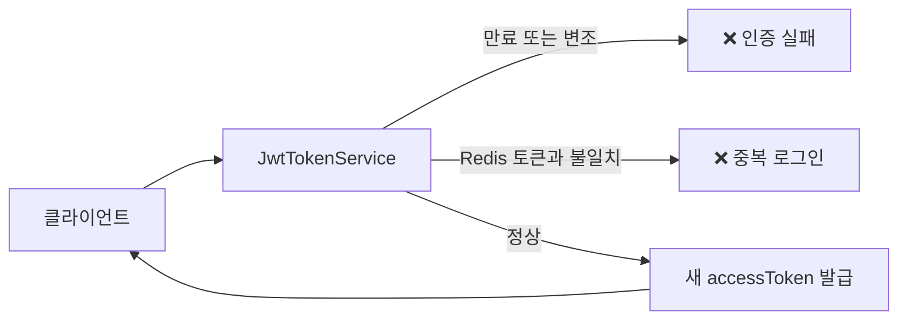
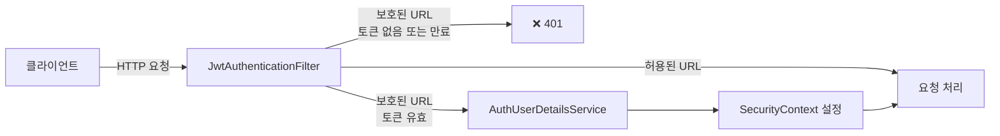
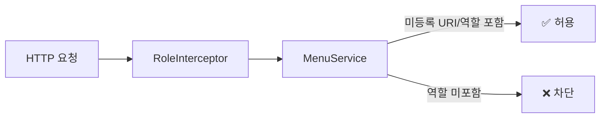

# basic-arch

---

## 1. 소개

실무 프로젝트를 수행하면서 아키텍처 규격의 부재로 인한 어려움이 많이 발생합니다. 비슷한 CRUD를 작업하는데도 로직이 제각각이거나, 서로 만든 서비스를 서로 갖다 쓰다가 순환참조 에러도 겪게 됩니다. 규격화된
환경에서 비즈니스 로직만 작업할 수 있으면 신규 개발하기도 훨씬 쉬울 거라고 생각해서 시작하게 된 프로젝트입니다.

| 분류       | 기술                                        |
|----------|-------------------------------------------|
| 언어 / 플랫폼 | Java 21, Spring Boot 3.5.9, Gradle 8.14   |
| 데이터 접근   | Spring Data JPA, QueryDSL 5.0, Flyway     |
| 매핑       | MapStruct 1.5.5, Lombok                   |
| 인증 / 보안  | Spring Security, JWT (jjwt 0.11.5)        |
| 캐시 / 세션  | Redis 7 (토큰 저장소 + 캐시)                     |
| 데이터베이스   | PostgreSQL 15                             |
| API 문서   | SpringDoc OpenAPI (Swagger UI)            |
| 외부 통신    | Spring WebFlux (WebClient)                |
| 로컬 인프라   | Docker Compose (PostgreSQL + Redis 자동 기동) |
| 모니터링     | Prometheus, Grafana, Actuator             |

---

## 2. 아키텍쳐 설계

### 레이어드 + Facade 패턴

[파사드 패턴이란?](https://medium.com/@harshitha.khandelwal/facade-design-pattern-explained-f8c8be035086)

**Facade 패턴을 선택한 이유**

- 서비스 간 순환 참조 방지

> 서비스 안에 다른서비스를 호출하는 걸 근본적으로 차단하기때문에, 순환 참조가 구조적으로 절대 발생할 수 없음

- Bean Validation 대신 [ToyAssert](src/main/java/com/example/basicarch/base/exception/ToyAssert.java)를 Facade에서 처리와 검증

> 입력, 비즈니스 검증이 Facade 레이어 한 곳에 모여 있어, 유지보수가 용이함



|                | 가능한것                                        | 안되는것                                            |
|----------------|---------------------------------------------|-------------------------------------------------|
| **Controller** | Facade 의존, 사용자 요청, 응답 반환                    | 검증 로직, 직접 Service 호출                            |
| **Facade**     | Service 의존, 입력값 검증, 예외 처리, 트랜잭션, 비즈니스 로직 조합 | Repository 직접 접근, HTTP 관련 코드                    |
| **Service**    | Repository의존, 단일 도메인 비즈니스 로직                | Repository 직접 접근, 예외, HTTP 관련 코드, 다른 Service 의존 |
| **Repository** | DB 접근, Query                                | 비즈니스 로직                                         |

### 프로젝트 공통 구조 - Base Class ###

| 클래스                                                                                    | 역할                                      |
|----------------------------------------------------------------------------------------|-----------------------------------------|
| [BaseService](src/main/java/com/example/basicarch/base/service/BaseService.java)       | 모든 Service가 구현하는 인터페이스. 동일한 메서드 시그니처 강제 |
| [BaseEntity](src/main/java/com/example/basicarch/base/model/BaseEntity.java)           | PK 체계 단일화, 생성일/수정일 이력 필드 자동화            |
| [BaseModel](src/main/java/com/example/basicarch/base/model/BaseModel.java)             | Facade/Controller 계층에서 사용하는 DTO 기반 클래스  |
| [BaseSearchParam](src/main/java/com/example/basicarch/base/model/BaseSearchParam.java) | 검색 조건 공통 파라미터 규격화                       |

### 공통 유틸리티

| 클래스                                                                                    | 주요 기능                                                 |
|----------------------------------------------------------------------------------------|-------------------------------------------------------|
| [StringUtils](src/main/java/com/example/basicarch/base/utils/StringUtils.java)         | isBlank/isEmpty, masking, lpad/rpad, regex, 포맷        |
| [DateUtils](src/main/java/com/example/basicarch/base/utils/DateUtils.java)             | LocalDateTime-Date-String 변환, 요일, 날짜 연산               |
| [CollectionUtils](src/main/java/com/example/basicarch/base/utils/CollectionUtils.java) | safeStream, merge, separationList, toMap, extractList |
| [CryptoUtils](src/main/java/com/example/basicarch/base/utils/CryptoUtils.java)         | 랜덤 문자열 생성, SecretKey 생성                               |
| [SessionUtils](src/main/java/com/example/basicarch/base/utils/SessionUtils.java)       | SecurityContext에서 현재 사용자 정보 조회                        |
| [CommonUtils](src/main/java/com/example/basicarch/base/utils/CommonUtils.java)         | HTTP 응답 직접 쓰기, JWT 디코딩                                |

### Entity / Model 분리

- **Entity** (`extends BaseEntity<Long>`): JPA 영속성 객체, DB와 직접 매핑하는 객체
- **Model** (`extends BaseModel<Long>`): Facade/Controller 계층에서 주고받는 객체
- **Converter** (MapStruct): 양방향 변환 (`toModel` / `toEntity`)

---

## 3. 기능

### 인증 흐름 — 로그인



### 인증 흐름 — AccessToken 재발급



> [RefreshTokenStore](src/main/java/com/example/basicarch/base/security/jwt/token/RefreshTokenStore.java)는 인터페이스로 추상화되어 있어 Redis 외 다른 저장소로 교체 가능합니다.

### 인증 흐름 — 요청 인증



### 동적 URI 권한 체크



### Redis 캐시 전략

| 캐시            | key:value                            | 갱신 주기          | 무효화 방식               |
|---------------|--------------------------------------|----------------|----------------------|
| Code 캐시       | {cache:code : all}                   | 스케줄러 N시간       | Redis Pub/Sub 즉시 무효화 |
| Menu 캐시       | {cache:menu : all / useYn:Y}         | 스케줄러 N시간       | Redis Pub/Sub 즉시 무효화 |
| Menu 역할 캐시    | {cache:menu:role : uri}              | 스케줄러 N시간       | Redis Pub/Sub 즉시 무효화 |
| Refresh Token | {jwt:refresh:loginId : refreshToken} | JWT 만료 시간(TTL) | 로그아웃/재로그인 시 삭제       |

> 스케줄러 갱신 주기는 [cron.yml](src/main/resources/cron.yml)에서 관리

### API 응답 형식

module 디렉터리 범위 안의 모든 응답은 [ResponseAdvice](src/main/java/com/example/basicarch/config/advice/ResponseAdvice.java)
가  [Response<T>](src/main/java/com/example/basicarch/base/model/Response.java)로 자동 래핑합니다.

```java
public static <T> Response<T> fail(int status, String error, String message) {
    return Response.<T>builder()
            .status(status)
            .error(error)
            .message(message)
            .build();
}

public static <T> Response<T> fail(int status, String message) {
    return Response.<T>builder()
            .status(status)
            .message(message)
            .build();
}
```

### 프로젝트 구조

```
src/main/java/com/example/basicarch/
├── base/        공통 인프라 (annotation, exception, model, redis, security, utils)
├── config/      Spring 설정 (Security, Redis, Swagger, advice, interceptor, scheduler)
└── module/
    ├── user/    사용자, 역할, 인증
    ├── code/    공통 코드/코드그룹
    ├── menu/    메뉴 관리
    └── file/    파일 업로드/다운로드
```

각 모듈은 `controller / facade / service / repository / converter / entity / model` 구조를 따릅니다.

### 주요 모듈

**user - 사용자**

Spring Security + JWT 기반 인증. `Role / UserRole / User` 구조로 권한을 관리하고, Redis에 Refresh Token을 저장해 체크합니다.

**code - 공통 코드**

`CodeGroup → Code` 1:N 계층으로 코드를 관리한다. code 값 없이 저장하면 자동으로 001, 002..., N 채번되고, 변경 시 리스너를 통한 캐시 무효화를 이용합니다.

**menu - 메뉴**

`id`와 `parentId` 를 이용한 트리 구조. DB에서 가져온 후 서버에서 트리로 조립합니다. 메뉴에 역할을
설정하면 [RoleInterceptor](src/main/java/com/example/basicarch/config/interceptor/RoleInterceptor.java)로 접근을 제한합니다.

**file - 파일**

refPath(테이블명) + refId(PK) 조합으로 어느 도메인에나 파일을 붙일 수 있습니다.

---

## 4. 실행 가이드

요구 사항: JDK 21, Docker(Windows는 WSL2 필요)

| 프로필     | 포트   |
|---------|------|
| `local` | 8085 |
| `dev`   | 8080 |
| `prod`  | 8080 |

### local 환경

Docker가 설치되어 있으면 프로젝트만 구동하면 됩니다. 프로젝트 구동
시, [LocalDockerConfig](src/main/java/com/example/basicarch/config/LocalDockerConfig.java)에서 프로젝트 인프라를 자동으로 세팅해줍니다.


### 접속 정보

- Swagger UI: http://localhost:8085/swagger-ui/index.html
- Prometheus: http://localhost:19090
- Grafana: http://localhost:13000

### Swagger UI ###


### Grafana ###


### 배포 (Railway)

main 브랜치 push 시 자동 배포됩니다.


---

## 5. 설계 결정

### JWT & Refresh Token

2022년도에 JWT 개념을 처음 접했습니다. 당시 Refresh Token을 인메모리로 관리했는데, 인스턴스가 재시작되면 토큰이 날아가고 사용자가 강제 로그아웃되는 문제가 있었습니다.
Basic-Arch에서는 처음부터 Redis에 저장하는 방식을 선택했기 때문에, 토큰관리를 좀더 용이하게 할수 있게 되었습니다.

**저장소 추상화 — RefreshTokenStore 인터페이스**

Refresh Token 저장소를 인터페이스로 분리했습니다. 현재 구현체는 Redis지만, 저장소 실제 구현체를 변경하는 것으로써, JWT 인증 로직은 전혀 건드리지 않아도 됩니다.

```java
public interface RefreshTokenStore {
    void save(String loginId, String refreshToken, long expirationDays);

    String findByLoginId(String loginId);

    void deleteByLoginId(String loginId);
}

@Component
public class RedisRefreshTokenStore implements RefreshTokenStore {
    private static final String KEY_PREFIX = "jwt:refresh:";
}
```

---

### 캐시 무효화 전략

실무에서 코드/메뉴 데이터를 캐싱하는 구조를 처음 접했을 때, 조회 성능은 확실히 좋았습니다. 하지만 캐시 무효화 전략이 없다 보니 데이터를 바꿔도 화면에 바로 반영이 안 되는 상황을 겪었습니다. 때문에 데이터가 변경되는 순간엔 Redis Pub/Sub으로 즉시 무효화하게끔 구현하였습니다.

```
  code  캐시  →  cache:code:all
  menu  캐시  →  cache:menu:all, cache:menu:role:{uri}
  token 저장  →  jwt:refresh:{loginId}  (TTL = JWT 만료 시간)
```

> 스케줄러 갱신 주기는 [cron.yml](src/main/resources/cron.yml)에서 관리

---

## 6. 로드맵

| 순서 | 기술                   | 학습 내용                                         | 상태  |
|----|----------------------|-----------------------------------------------|-----|
| 1  | Prometheus + Grafana | Actuator 메트릭 수집, 대시보드 구성                      | 완료  |
| 2  | Kubernetes           | minikube로 현재 프로젝트 배포, 및 실습                    | 진행중 |
| 3  | Kafka                | docker-compose에 Kafka 추가하고 Redis 데이터 유실 문제 처리 | 대기  |
